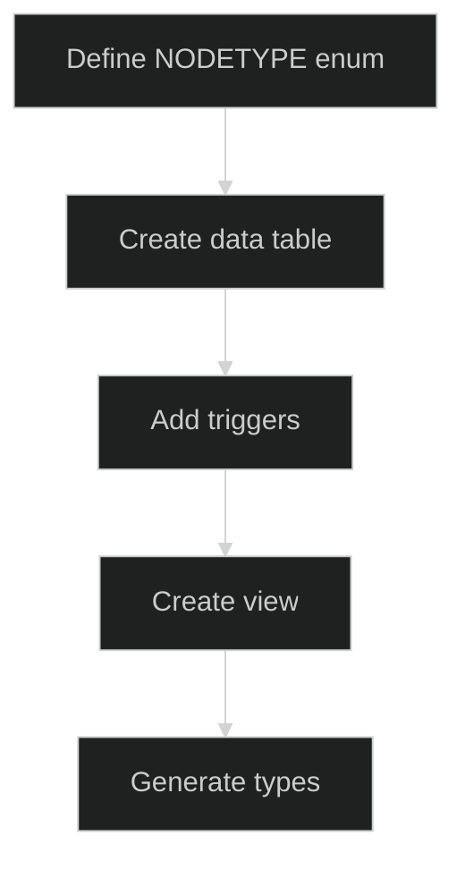

# qx-db

When complete, qx-db will provide a universal data layer where any application can store, query, and relate any type of data through a consistent interface, transforming disconnected data silos into a unified knowledge graph.

## I | Foundation: Core database schema and basic operations

- ✓ node | Universal entity table for all data types
- ✓ root | Authentication linkage between auth.users and nodes
- ✓ link | Semantic relationships between nodes
- ✓ item | Hierarchical parent-child relationships
- ✓ text | Text content storage
- ✓ file | File metadata storage
- ✓ tile | Visual rendering configuration
- ✓ module:db.trigger_set_updated_at | Automatic timestamp updates: () -> trigger
- ✓ module:db.get_dsts | Get destination nodes from links: (src_id) -> nodes
- ✓ module:db.get_srcs | Get source nodes from links: (dst_id) -> nodes
- ✓ module:db.get_items | Get items by ID with optional variants: (item_id, variants?) -> items
- ✓ data_user | User profile data storage
- ✓ module:db.trigger_data_insert | Auto-create nodes when data inserted: () -> trigger
- ✓ module:db.check_node_has_data | Constraint ensuring nodes have data: () -> trigger
- ✓ module:db.get_nbrs | Get all neighbors (links + descendants): (node_id) -> neighbors

```mermaid
%%{init: {'theme': 'dark'}}%%
graph TD
    [(node)] --> [(text)]
    [(node)] --> [(file)]
    [(node)] --> [(data_user)]
    [(root)] --> [(node)]
    [(root)] --> [(auth.users)]
    [(link)] --> [(node)]
    [(item)] --> [(node)]
    [(item)] --> [(tile)]
```

## Later

- [ ] cli:qx.add_data_type | Add new data types with automatic schema generation: (type_name, fields) -> schema_migration
- [ ] api:qx.get_node | Retrieve any node with its data: (node_id) -> node + data
- [ ] api:qx.add_node | Create nodes of any type: (type, data) -> node
- [ ] api:qx.link_nodes | Create semantic relationships: (src_id, dst_id, predicate) -> link
- [ ] cli:qx.generate_types | Auto-generate TypeScript types from schema
- [ ] module:graph.traverse | Navigate relationships efficiently: (start_node, depth, filters) -> graph
- [ ] api:qx.subscribe | Real-time updates via Supabase: (filters) -> subscription
- [ ] api:qx.batch | Efficient bulk data operations: (operations[]) -> results[]
- [ ] module:search.vector | Vector search capabilities: (embedding, threshold) -> nodes
- [ ] module:query.time_travel | Historical data viewing: (timestamp) -> snapshot

## Database Schema

```sql
-- Enums
CREATE TYPE NODETYPE AS ENUM ('file', 'text', 'user');
CREATE TYPE FILETYPE AS ENUM ('csv', 'png', 'md');
CREATE TYPE ANCHOR AS ENUM ('lhs', 'rhs', 'flow');
CREATE TYPE VISUAL AS ENUM ('sec', 'doc', 'dir');
CREATE TYPE LAYOUT AS ENUM ('panel', 'slideshow');

-- Core polymorphic node system
CREATE TABLE node (
    id SERIAL PRIMARY KEY,
    created_at TIMESTAMP DEFAULT NOW(),
    updated_at TIMESTAMP DEFAULT NOW(),
    type NODETYPE NOT NULL
);

CREATE TABLE root (
    id SERIAL PRIMARY KEY,
    user_id UUID NOT NULL REFERENCES auth.users(id) ON DELETE CASCADE,
    node_id INTEGER NOT NULL REFERENCES node(id) ON DELETE CASCADE,
    created_at TIMESTAMP DEFAULT NOW(),
    updated_at TIMESTAMP DEFAULT NOW(),
    email TEXT UNIQUE,
    UNIQUE (node_id)
);

-- Relationships
CREATE TABLE link (
    id SERIAL PRIMARY KEY,
    created_at TIMESTAMP DEFAULT NOW(),
    updated_at TIMESTAMP DEFAULT NOW(),
    src_id INTEGER NOT NULL REFERENCES node(id) ON DELETE CASCADE,
    dst_id INTEGER NOT NULL REFERENCES node(id) ON DELETE CASCADE,
    CHECK (src_id != dst_id),
    UNIQUE (src_id, dst_id)
);

CREATE TABLE item (
    id SERIAL PRIMARY KEY,
    created_at TIMESTAMP DEFAULT NOW(),
    updated_at TIMESTAMP DEFAULT NOW(),
    node_id INTEGER NOT NULL REFERENCES node(id) ON DELETE CASCADE,
    desc_id INTEGER REFERENCES item(id) ON DELETE CASCADE,
    next_id INTEGER REFERENCES item(id) ON DELETE SET NULL,
    tile_id INTEGER NOT NULL REFERENCES tile(id) ON DELETE CASCADE,
    CHECK (id != desc_id),
    CHECK (id != next_id),
    UNIQUE (tile_id),
    UNIQUE (node_id)
);

-- Data tables
CREATE TABLE text (
    id SERIAL PRIMARY KEY,
    node_id INTEGER NOT NULL REFERENCES node(id) ON DELETE CASCADE,
    created_at TIMESTAMP DEFAULT NOW(),
    updated_at TIMESTAMP DEFAULT NOW(),
    content TEXT NOT NULL,
    UNIQUE (node_id)
);

CREATE TABLE file (
    id SERIAL PRIMARY KEY,
    node_id INTEGER NOT NULL REFERENCES node(id) ON DELETE CASCADE,
    created_at TIMESTAMP DEFAULT NOW(),
    updated_at TIMESTAMP DEFAULT NOW(),
    type FILETYPE NOT NULL,
    bytes BYTEA NOT NULL,
    uri TEXT NOT NULL,
    UNIQUE (node_id)
);

-- Rendering
CREATE TABLE tile (
    id SERIAL PRIMARY KEY,
    created_at TIMESTAMP DEFAULT NOW(),
    updated_at TIMESTAMP DEFAULT NOW(),
    x REAL NOT NULL,
    y REAL NOT NULL,
    w REAL NOT NULL,
    h REAL NOT NULL,
    viewboxX REAL NOT NULL,
    viewboxY REAL NOT NULL,
    viewboxZoom REAL NOT NULL,
    layout LAYOUT,
    visual VISUAL,
    anchor ANCHOR,
    motion BOOLEAN DEFAULT FALSE,
    active BOOLEAN DEFAULT FALSE,
    style JSONB
);

-- Data tables follow the data_* naming pattern
CREATE TABLE data_user (
    id SERIAL PRIMARY KEY,
    node_id INTEGER NOT NULL REFERENCES node(id) ON DELETE CASCADE,
    created_at TIMESTAMP DEFAULT NOW(),
    updated_at TIMESTAMP DEFAULT NOW(),
    username TEXT UNIQUE NOT NULL,
    display_name TEXT,
    bio TEXT,
    avatar_url TEXT,
    preferences JSONB DEFAULT '{}',
    UNIQUE (node_id)
);

-- Indexes
-- Node indexes
CREATE INDEX node_index_type ON node(type);
CREATE INDEX node_index_created_at ON node(created_at);
CREATE INDEX node_index_updated_at ON node(updated_at);

-- Root indexes
CREATE INDEX root_index_user_id ON root(user_id);
CREATE INDEX root_index_email ON root(email) WHERE email IS NOT NULL;

-- Link indexes
CREATE INDEX link_index_src_id ON link(src_id);
CREATE INDEX link_index_dst_id ON link(dst_id);
CREATE INDEX link_index_created_at ON link(created_at);

-- Item indexes
CREATE INDEX item_index_desc_id ON item(desc_id) WHERE desc_id IS NOT NULL;
CREATE INDEX item_index_next_id ON item(next_id) WHERE next_id IS NOT NULL;
CREATE INDEX item_index_node_id ON item(node_id);
CREATE INDEX item_index_tile_id ON item(tile_id);
CREATE INDEX item_index_root ON item(id) WHERE desc_id IS NULL AND next_id IS NULL;
CREATE INDEX item_index_peers ON item(desc_id, next_id) WHERE desc_id IS NOT NULL;

-- Tile indexes
CREATE INDEX tile_index_anchor ON tile(anchor) WHERE anchor IS NOT NULL;
CREATE INDEX tile_index_visual ON tile(visual) WHERE visual IS NOT NULL;
CREATE INDEX tile_index_layout ON tile(layout) WHERE layout IS NOT NULL;
CREATE INDEX tile_index_active ON tile(active) WHERE active = TRUE;
CREATE INDEX tile_index_position ON tile USING btree (x, y, w, h);

-- Text indexes
CREATE INDEX idx_text_node_id ON text(node_id);
CREATE INDEX idx_text_content_fts ON text USING gin(TO_TSVECTOR('english', content));

-- File indexes
CREATE INDEX idx_file_node_id ON file(node_id);
CREATE INDEX idx_file_type ON file(type);
CREATE INDEX idx_file_uri ON file(uri);

-- Data_user indexes
CREATE INDEX idx_data_user_node_id ON data_user(node_id);
CREATE INDEX idx_data_user_username ON data_user(username);
```

## Installation

```bash
# Clone repository
git clone https://github.com/yourusername/qx-db.git
cd qx-db

# Install Supabase CLI
brew install supabase/tap/supabase

# Configure environment
# Create a .env file with your Supabase credentials:
# SUPABASE_URL=your_project_url
# SUPABASE_ANON_KEY=your_anon_key

# Apply database migrations
supabase db push
```

## Developer Guide

### Data Polymorphism Pattern

- **Data interface**: `Data = DataText | DataFile | DataUser | ...`
- **Naming convention**: All data tables follow `data_<type>` pattern (except legacy `text` and `file`)
- **Node relationship**: Data tables have `node_id` foreign key with cascade delete
- **Automatic node creation**: Insert trigger creates node if not provided
- **Constraint enforcement**: Deferred constraint ensures every node has data

### Adding a New Data Type



```sql
-- 1. Add enum value
ALTER TYPE NODETYPE ADD VALUE 'example';

-- 2. Create data table (follow data_* naming)
CREATE TABLE data_example (
    id SERIAL PRIMARY KEY,
    node_id INTEGER NOT NULL REFERENCES node(id) ON DELETE CASCADE,
    created_at TIMESTAMP DEFAULT NOW(),
    updated_at TIMESTAMP DEFAULT NOW(),
    example_field TEXT NOT NULL
);

-- 3. Add triggers
CREATE TRIGGER data_example_trigger_updated_at
    BEFORE UPDATE ON data_example
    FOR EACH ROW
    EXECUTE FUNCTION trigger_set_updated_at();

CREATE TRIGGER data_example_trigger_insert_node
    BEFORE INSERT ON data_example
    FOR EACH ROW
    EXECUTE FUNCTION trigger_data_insert();

-- 4. Create indexes
CREATE INDEX idx_data_example_node_id ON data_example(node_id);

-- 5. Update check_node_has_data() function to include new table
```

### Working with Nodes

```typescript
// Create a text node (auto-creates node via trigger)
const { data: textData } = await supabase
  .from("text")
  .insert({
    content: "Hello, world!",
  })
  .select("*, node(*)")
  .single();

// Create relationships
const { data: link } = await supabase.from("link").insert({
  src_id: sourceNodeId,
  dst_id: targetNodeId,
});

// Query with relationships
const { data: nodes } = await supabase.from("node").select(`
    *,
    text(*),
    file(*),
    data_user(*),
    links_as_src:link!src_id(*),
    links_as_dst:link!dst_id(*)
  `);

// Get neighbors using RPC
const { data: neighbors } = await supabase.rpc("get_nbrs", { node_id: nodeId });

// Full-text search in text content
const { data: searchResults } = await supabase
  .from("text")
  .select("*, node(*)")
  .textSearch("content", "search terms", {
    config: "english",
  });
```

## Exclusions

- **INHERITS for polymorphism**: Partition/inheritance conflicts
- **Table partitioning**: Not needed at current scale
- **JSONB storage**: Typed columns for better constraints
- **Materialized views**: Performance not yet a concern
- **Multi-tenancy**: Single-tenant design
- **ORM layers**: Direct SQL and Supabase client
- **Complex migrations**: Schema-first approach
- **TypeScript/JavaScript implementation**: SQL-only project currently
- **API/CLI tools**: Database schema focus first
- **ascn_id/prev_id naming**: Using desc_id (descendant) and next_id for clearer hierarchical semantics

### Item-Tile non-Reverse Ownership

**Proof by contradiction:**

- Item has a foreign key to Tile, but Tile does not have a foreign key to Item (this would be normalization which we avoid)
- However, referential integrity is broken as a tile does not need a an item to exist
- However, we need this to be the case to allow ephemeral tiles (eg for links)
- However, these don't actually need to exist in the database
- So, reverse ownership gives referential integrity and still allows for ephemeral tiles

### Item-Tile Uniqueness

- Could be not unique (eg multiple items point to the same tile)
  - Tiles are already a rendered representation of a node, which has Item [n>1] Node, so it's **almost** redundant

## Tests

### On Deploy

- Database migrations apply successfully
- All triggers fire correctly (updated_at, data_insert, check_node_has_data deferred constraint)
- Constraint checks pass (node-data integrity, unique constraints on node_id relationships)
- Functions return expected data (get_dsts, get_srcs, get_nbrs, get_items with optional variants)
- All indexes created successfully (performance, unique, partial, and full-text search)

### On Edit

- Schema changes are backward compatible
- New data types follow `data_*` naming convention
- Triggers are created for new tables (updated_at, insert_node)
- check_node_has_data() function updated for new data types
- Documentation is updated

## Research

### Sources

- [PostgreSQL Inheritance Documentation](https://www.postgresql.org/docs/current/ddl-inherit.html)
- [Supabase Auth Documentation](https://supabase.com/docs/guides/auth)
- [PostgREST API Guide](https://postgrest.org/en/stable/)

### Future Considerations

- **Vector embeddings**: Semantic search capabilities
- **Audit trails**: Track all changes to nodes
- **Performance indexing**: Add as usage patterns emerge
