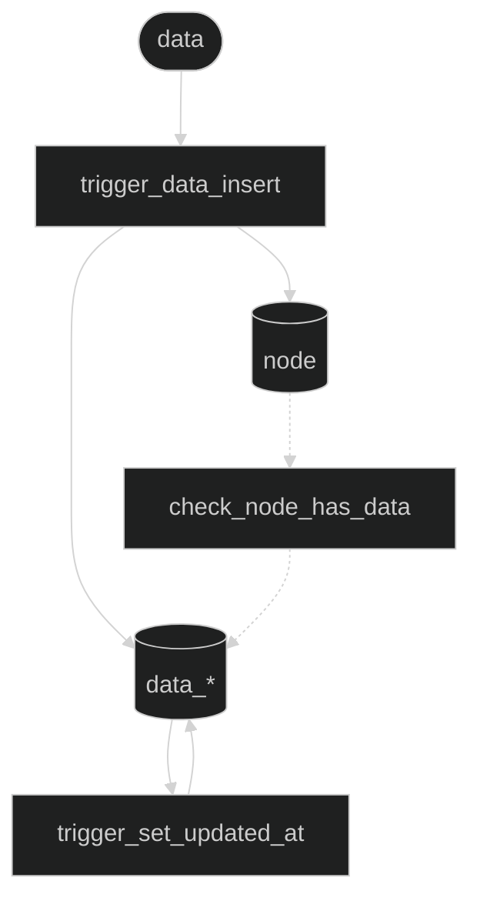

# qx-db

When complete, qx-db will provide a universal data layer where any application can store, query, and relate any type of data through a consistent interface, transforming disconnected data silos into a unified knowledge graph.

## Givens

- **Architecture**: PostgreSQL schema with polymorphic node system
- **Access**: Supabase for authentication, real-time, and API layer
- **Pattern**: All data types reference a central node table via foreign key
- **Naming**: Data tables follow `data_*` convention (except legacy `text` and `file`)
- **Constraints**: Deferred constraint ensures every node has associated data
- **Triggers**: Automatic node creation on data insert, timestamp updates
- **Container names**: Supabase CLI uses `supabase_<service>_qx` pattern
- **Performance**: Indexes on foreign keys, search fields, and common queries

## Phases

### Foundation: Core database schema and basic operations

- **Interfaces**

- ✓ `node`: Universal entity table for all data types (id, type, created_at, updated_at)
- ✓ `root`: Authentication linkage between auth.users and nodes
- ✓ `link`: Semantic relationships between nodes (src_id, dst_id)
- ✓ `item`: Hierarchical relationships (node_id, desc_id, next_id, tile_id)
- ✓ `text`: Text content storage (node_id, content)
- ✓ `file`: File metadata storage (node_id, type, bytes, uri)
- ✓ `tile`: Visual rendering configuration (x, y, w, h, viewbox, layout, visual, anchor)
- ✓ `data_user`: User profile data (node_id, username, display_name, bio, avatar_url, preferences)
- ✓ `trigger_set_updated_at() -> trigger`: Automatic timestamp updates
- ✓ `get_dsts(src_id: integer) -> node[]`: Get destination nodes from links
- ✓ `get_srcs(dst_id: integer) -> node[]`: Get source nodes from links
- ✓ `get_items(item_id: integer, variants?: jsonb) -> item[]`: Get items by ID
- ✓ `trigger_data_insert() -> trigger`: Auto-create nodes when data inserted
- ✓ `check_node_has_data() -> trigger`: Constraint ensuring nodes have data
- ✓ `get_nbrs(node_id: integer) -> table(neighbor_id: integer, relationship_type: text)`: Get all neighbors

- **Flow**



### Data Types: Extensible polymorphic data system

- **Interfaces**

- [ ] `qx add-data-type --name <string> --fields <json>`: Add new data types with automatic schema generation
- [ ] `POST /api/nodes`: Create nodes of any type `(type: string, data: object) -> {id: string, node: Node}`
- [ ] `GET /api/nodes/:id`: Retrieve any node with its data `(node_id: string) -> Node & Data`
- [ ] `POST /api/links`: Create semantic relationships `(src_id: string, dst_id: string, predicate?: string) -> Link`
- [ ] `qx generate-types`: Auto-generate TypeScript types from schema

- **Flow**

```mermaid
%%{init: {'theme': 'dark'}}%%
graph TB
  %% CLI command
  CLI[qx add-data-type --name example --fields '{...}']
  
  %% Processing
  Parse[parse_fields]
  Validate[validate_schema]
  Generate[generate_migration]
  
  %% Database operations
  AlterEnum[ALTER TYPE NODETYPE]
  CreateTable[(data_example)]
  AddTriggers[add_triggers]
  UpdateFunction[update check_node_has_data]
  
  %% Results
  Migration([migration.sql])
  Types([types.ts])
  
  %% Flow
  CLI --> Parse
  Parse --> Validate
  Validate --> Generate
  Generate --> AlterEnum
  AlterEnum --> CreateTable
  CreateTable --> AddTriggers
  AddTriggers --> UpdateFunction
  UpdateFunction --> Migration
  Migration --> Types
```

### Graph Operations: Efficient relationship traversal

- **Interfaces**

- [ ] `graph.traverse(start_node: integer, depth: integer, filters?: Filter[]) -> Graph`: Navigate relationships efficiently
- [ ] `POST /api/subscribe`: Real-time updates via Supabase `(filters: Filter[]) -> Subscription`
- [ ] `POST /api/batch`: Efficient bulk operations `(operations: Operation[]) -> Result[]`
- [ ] `search.vector(embedding: float[], threshold: float) -> node[]`: Vector search capabilities
- [ ] `query.time_travel(timestamp: string) -> Snapshot`: Historical data viewing

### Later

- Advanced search with vector embeddings
- Audit trail for all node changes
- Performance monitoring and optimization
- GraphQL API layer
- Data export/import utilities
- Schema versioning and migrations
- Multi-tenant support
- Distributed node replication

## Exclusions

- **INHERITS for polymorphism**: Partition/inheritance conflicts prevent usage
  - Issue: Cannot use table inheritance with partitioning in PostgreSQL
  - Decision: Use foreign key relationships to central node table instead
- **Table partitioning**: Not needed at current scale
  - Threshold: Consider when node table exceeds 10M records
- **JSONB storage**: Typed columns provide better constraints
  - Exception: Still used for flexible fields like preferences, style
- **Materialized views**: Performance not yet a concern
  - Metric: Query times consistently under 100ms
- **Multi-tenancy**: Single-tenant design
  - Reason: Complexity without current requirement
- **ORM layers**: Direct SQL and Supabase client
  - Benefit: Full control over query optimization
- **Complex migrations**: Schema-first approach
  - Method: Forward-only migrations, no rollbacks
- **ascn_id/prev_id naming**: Using desc_id/next_id
  - Clarity: desc_id (descendant) better indicates hierarchical relationship
- **Item-Tile reverse ownership**: Tiles don't reference items
  - Reason: Allows ephemeral tiles for rendering without persistence
  - Trade-off: Sacrifices referential integrity for flexibility

## Tests

- **on deploy**:
  - Database migrations apply successfully
  - All triggers fire correctly (updated_at, data_insert, check_node_has_data)
  - Constraint checks pass (node-data integrity, unique constraints)
  - Functions return expected data (get_dsts, get_srcs, get_nbrs, get_items)
  - Indexes created successfully (performance, unique, partial, full-text)
  
- **on edit**:
  - Schema changes are backward compatible
  - New data types follow `data_*` naming convention
  - Triggers created for new tables (updated_at, insert_node)
  - check_node_has_data() function updated for new data types
  - Documentation reflects current schema state

## Installation

```bash
# Clone repository
git clone https://github.com/yourusername/qx-db.git
cd qx-db

# Install Supabase CLI
brew install supabase/tap/supabase

# Configure environment
# Create .env with your Supabase credentials:
# SUPABASE_URL=your_project_url
# SUPABASE_ANON_KEY=your_anon_key

# Apply database migrations
supabase db push
```

## Developer Guide

### Working with Nodes

```sql
-- Create a text node (auto-creates node via trigger)
INSERT INTO text (content) VALUES ('Hello, world!');

-- Create relationships
INSERT INTO link (src_id, dst_id) VALUES (1, 2);

-- Query nodes with their data
SELECT n.*, t.content, f.uri, u.username
FROM node n
LEFT JOIN text t ON t.node_id = n.id
LEFT JOIN file f ON f.node_id = n.id
LEFT JOIN data_user u ON u.node_id = n.id;

-- Get neighbors of a node
SELECT * FROM get_nbrs(1);
```

### Adding a New Data Type

1. Add enum value: `ALTER TYPE NODETYPE ADD VALUE 'example';`
2. Create data table following `data_*` naming:
```sql
CREATE TABLE data_example (
    id SERIAL PRIMARY KEY,
    node_id INTEGER NOT NULL REFERENCES node(id) ON DELETE CASCADE,
    created_at TIMESTAMP DEFAULT NOW(),
    updated_at TIMESTAMP DEFAULT NOW(),
    example_field TEXT NOT NULL,
    UNIQUE (node_id)
);
```
3. Add triggers for automatic timestamps and node creation
4. Update `check_node_has_data()` function
5. Create indexes on foreign keys and search fields

