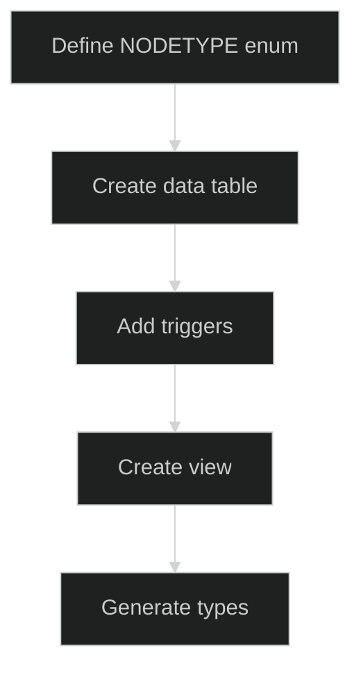

# QX Database

**One graph, infinite views**: A shared schema for the QX ecosystem

## Preamble

When complete, QX Database will provide a universal data layer where any application can store, query, and relate any type of data through a consistent interface, transforming disconnected data silos into a unified knowledge graph.

## Notes

- **Schema-first design**: Database as the source of truth
- **Polymorphic architecture**: All data types share a common node interface
- **Trigger-based automation**: Automatic node creation and relationship management
- **Advisory locks**: Race condition prevention for concurrent node creation

## Roadmap

### Phase I | Foundation: Core database schema and basic operations

- ✓ node | Universal entity table for all data types
- ✓ root | Container for grouping related nodes  
- ✓ link | Semantic relationships between nodes
- ✓ item | Hierarchical parent-child relationships
- ✓ data_text | Text content storage
- ✓ data_file | File metadata storage
- ✓ tile | Visual rendering configuration
- ✓ profiles | User profile data with RLS
- ✓ module:db.ensure_node_exists | Automatic node creation with race-condition prevention: (node_type) -> trigger
- ✓ module:db.get_descs | Get all descendants of a node: (node_id) -> items with depth

```mermaid
%%{init: {'theme': 'dark'}}%%
graph TD
    [(node)] --> [(data_text)]
    [(node)] --> [(data_file)]
    [(node)] --> [(tile)]
    [(root)] --> [(node)]
    [(node)] --> [(link)]
    [(node)] --> [(item)]
    [(auth.users)] --> [(profiles)]
```

### Phase II | Developer Experience: Tools and workflows

- [ ] cli:qx.add_data_type | Add new data types with automatic schema generation: (type_name, fields) -> schema_migration
- [ ] api:qx.get_node | Retrieve any node with its data: (node_id) -> node + data
- [ ] api:qx.create_node | Create nodes of any type: (type, data) -> node
- [ ] api:qx.link_nodes | Create semantic relationships: (src_id, dst_id, predicate) -> link
- [ ] cli:qx.generate_types | Auto-generate TypeScript types from schema

### Phase III | Advanced Features: Complex queries and visualizations

- [ ] module:graph.traverse | Navigate relationships efficiently: (start_node, depth, filters) -> graph
- [ ] module:search.full_text | Search across all text content: (query, options) -> nodes
- [ ] api:qx.subscribe | Real-time updates via Supabase: (filters) -> subscription
- [ ] api:qx.batch | Efficient bulk data operations: (operations[]) -> results[]
- [ ] module:search.vector | Vector search capabilities: (embedding, threshold) -> nodes
- [ ] module:query.time_travel | Historical data viewing: (timestamp) -> snapshot

## Database Schema

```sql
-- Core polymorphic node system
CREATE TABLE node (
    id UUID PRIMARY KEY DEFAULT gen_random_uuid(),
    created_at TIMESTAMP WITH TIME ZONE DEFAULT NOW() NOT NULL,
    updated_at TIMESTAMP WITH TIME ZONE DEFAULT NOW() NOT NULL,
    root_id UUID REFERENCES root(id),
    type NODETYPE NOT NULL
);

CREATE TABLE root (
    id UUID PRIMARY KEY DEFAULT gen_random_uuid(),
    created_at TIMESTAMP WITH TIME ZONE DEFAULT NOW() NOT NULL,
    updated_at TIMESTAMP WITH TIME ZONE DEFAULT NOW() NOT NULL
);

-- Relationships
CREATE TABLE link (
    id UUID PRIMARY KEY DEFAULT gen_random_uuid(),
    created_at TIMESTAMP WITH TIME ZONE DEFAULT NOW() NOT NULL,
    updated_at TIMESTAMP WITH TIME ZONE DEFAULT NOW() NOT NULL,
    src_id UUID NOT NULL REFERENCES node(id) ON DELETE CASCADE,
    dst_id UUID NOT NULL REFERENCES node(id) ON DELETE CASCADE,
    predicate TEXT NOT NULL
);

CREATE TABLE item (
    id UUID PRIMARY KEY DEFAULT gen_random_uuid(),
    created_at TIMESTAMP WITH TIME ZONE DEFAULT NOW() NOT NULL,
    updated_at TIMESTAMP WITH TIME ZONE DEFAULT NOW() NOT NULL,
    parent_id UUID NOT NULL REFERENCES node(id) ON DELETE CASCADE,
    child_id UUID NOT NULL REFERENCES node(id) ON DELETE CASCADE,
    rank TEXT NOT NULL
);

-- Data tables
CREATE TABLE data_text (
    id UUID PRIMARY KEY REFERENCES node(id) ON DELETE CASCADE,
    created_at TIMESTAMP WITH TIME ZONE DEFAULT NOW() NOT NULL,
    updated_at TIMESTAMP WITH TIME ZONE DEFAULT NOW() NOT NULL,
    text TEXT NOT NULL
);

CREATE TABLE data_file (
    id UUID PRIMARY KEY REFERENCES node(id) ON DELETE CASCADE,
    created_at TIMESTAMP WITH TIME ZONE DEFAULT NOW() NOT NULL,
    updated_at TIMESTAMP WITH TIME ZONE DEFAULT NOW() NOT NULL,
    bucket TEXT NOT NULL,
    path TEXT NOT NULL,
    bytes BIGINT NOT NULL,
    type FILETYPE NOT NULL
);

-- Rendering
CREATE TABLE tile (
    id UUID PRIMARY KEY REFERENCES node(id) ON DELETE CASCADE,
    created_at TIMESTAMP WITH TIME ZONE DEFAULT NOW() NOT NULL,
    updated_at TIMESTAMP WITH TIME ZONE DEFAULT NOW() NOT NULL,
    x INTEGER NOT NULL DEFAULT 0,
    y INTEGER NOT NULL DEFAULT 0,
    w INTEGER NOT NULL DEFAULT 200,
    h INTEGER NOT NULL DEFAULT 200,
    viewbox_x REAL NOT NULL DEFAULT 0,
    viewbox_y REAL NOT NULL DEFAULT 0,
    viewbox_zoom REAL NOT NULL DEFAULT 1,
    anchor ANCHOR NOT NULL DEFAULT 'center',
    visual VISUAL NOT NULL DEFAULT 'padded',
    layout LAYOUT NOT NULL DEFAULT 'none',
    motion TEXT,
    active BOOLEAN NOT NULL DEFAULT false,
    style TEXT
);

-- User profiles
CREATE TABLE profiles (
    id UUID PRIMARY KEY REFERENCES auth.users(id) ON DELETE CASCADE,
    created_at TIMESTAMP WITH TIME ZONE DEFAULT NOW() NOT NULL,
    updated_at TIMESTAMP WITH TIME ZONE DEFAULT NOW() NOT NULL,
    username TEXT UNIQUE,
    full_name TEXT,
    avatar_url TEXT
);

-- Enums
CREATE TYPE NODETYPE AS ENUM ('text', 'file', 'tile', 'profile');
CREATE TYPE FILETYPE AS ENUM ('image', 'video', 'audio', 'document', 'data', 'code', 'archive', 'unknown');
CREATE TYPE ANCHOR AS ENUM ('center', 'north', 'northeast', 'east', 'southeast', 'south', 'southwest', 'west', 'northwest');
CREATE TYPE VISUAL AS ENUM ('padded', 'full', 'cover', 'contain', 'tile');
CREATE TYPE LAYOUT AS ENUM ('none', 'row', 'column', 'grid', 'text');
```

## Installation

```bash
# Clone and install
git clone https://github.com/yourusername/qx-db.git
cd qx-db
pnpm install

# Install Supabase CLI
brew install supabase/tap/supabase

# Configure environment
cp .env.example .env

# Start services
pnpm supabase:start
pnpm db:push
```

## Developer Guide

### Adding a New Data Type



```sql
-- 1. Add enum value
ALTER TYPE NODETYPE ADD VALUE 'example';

-- 2. Create data table
CREATE TABLE data_example (
    id UUID PRIMARY KEY REFERENCES node(id) ON DELETE CASCADE,
    created_at TIMESTAMP WITH TIME ZONE DEFAULT NOW() NOT NULL,
    updated_at TIMESTAMP WITH TIME ZONE DEFAULT NOW() NOT NULL,
    example_field TEXT NOT NULL
);

-- 3. Add triggers
CREATE TRIGGER ensure_node_exists_for_data_example
    BEFORE INSERT ON data_example
    FOR EACH ROW
    EXECUTE FUNCTION ensure_node_exists('example');

-- 4. Create view
CREATE VIEW example AS
SELECT n.*, d.example_field
FROM node n
JOIN data_example d ON n.id = d.id
WHERE n.type = 'example';
```

### Working with Nodes

```typescript
// Create a text node
const { data: node } = await supabase
  .from('data_text')
  .insert({ text: 'Hello, world!' })
  .select('*, node(*)')
  .single();

// Create relationships
const { data: link } = await supabase
  .from('link')
  .insert({
    src_id: sourceNode.id,
    dst_id: targetNode.id,
    predicate: 'references'
  });

// Query with relationships
const { data: nodes } = await supabase
  .from('text')
  .select(`
    *,
    links_as_src:link!src_id(*, destination:node!dst_id(*)),
    links_as_dst:link!dst_id(*, source:node!src_id(*))
  `);
```

## Exclusions

- **INHERITS for polymorphism**: Partition/inheritance conflicts
- **Table partitioning**: Not needed at current scale
- **JSONB storage**: Typed columns for better constraints
- **Materialized views**: Performance not yet a concern
- **Multi-tenancy**: Single-tenant design
- **ORM layers**: Direct SQL and Supabase client
- **Complex migrations**: Schema-first approach

## Tests

### On Deploy
- Database migrations apply successfully
- All triggers fire correctly
- Views return expected data
- TypeScript types match schema
- RLS policies enforce correctly

### On Edit
- Schema changes are backward compatible
- New data types follow naming conventions
- Triggers are created for new tables
- Documentation is updated

## Research

### Sources
- [PostgreSQL Inheritance Documentation](https://www.postgresql.org/docs/current/ddl-inherit.html)
- [Supabase Auth Documentation](https://supabase.com/docs/guides/auth)
- [PostgREST API Guide](https://postgrest.org/en/stable/)

### Future Considerations
- **Vector embeddings**: Semantic search capabilities
- **Audit trails**: Track all changes to nodes
- **Performance indexing**: Add as usage patterns emerge

## License

MIT License - see [LICENSE](LICENSE) for details